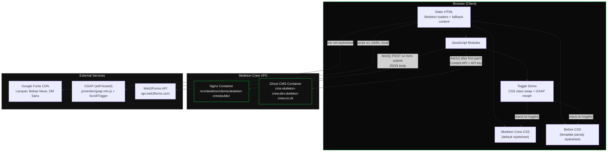

# Architect Output - Skeleton Crew Frontend Site

---

## 1. Ghost CMS Content Model Design

### 1.1 Portfolio Entries

Straightforward use of Ghost posts. No design decisions required - the brief prescribes this model.

| Field | Ghost field | Usage |
|---|---|---|
| Project name | `title` | Card heading |
| Description | `custom_excerpt` | One-line description on card |
| Screenshot | `feature_image` | Card image |
| Live URL | `canonical_url` | "View site" link (stored via canonical URL field in Ghost editor) |
| Category | `primary_tag` | Future filtering if needed |
| Sort order | `published_at` | Controls display order (newest first) |

**API query:**
```
GET /ghost/api/content/posts/?key=6a81932590f32d95416a5191a7&filter=tag:portfolio&include=tags&fields=title,custom_excerpt,feature_image,canonical_url,published_at&order=published_at%20desc
```

**Tag setup:** Create a tag `portfolio` in Ghost. Each portfolio entry is a published post with this tag.

**Note on `canonical_url`:** Ghost exposes `canonical_url` via the Content API (under the `url` field when using the `absolute_urls` option, or directly as `canonical_url`). This avoids abusing code injection or metadata fields to store external links. The operator sets the canonical URL in the post settings sidebar to the live client site URL.

---

### 1.2 Pricing Tiers

**Options evaluated:**

| Option | Description | Operator UX | Frontend complexity | API simplicity |
|---|---|---|---|---|
| A: Six posts (tagged `pricing-website` / `pricing-ai`) | Each tier is a separate post. Structured data in HTML body. | Good - each tier edited independently. Clear list in Ghost. | Medium - parse HTML from each post body. | Good - one query per category with tag filter. |
| B: Two pages (one per category) | One page for "Website Builds", one for "AI Consulting". Tiers structured as HTML sections within each page. | Good - all tiers for a category visible in one editor view. | Medium - parse HTML sections from page body. | Good - fetch by slug. |
| C: Single page with both categories | All six tiers in one page, separated by HTML sections with `data-` attributes. | Acceptable - long page but everything in one place. | Medium - same HTML parsing, more complex selectors. | Simple - one fetch. |

**Recommendation: Option A - six individual posts.**

Justification:
- The operator is a developer - managing six clearly-named posts is not a UX burden.
- Each tier is independently editable, publishable, and reorderable.
- Ghost's post list provides a clean overview when filtered by tag.
- Frontend parsing is simpler: each post body contains a single tier's data rather than needing to extract sections from a monolithic page.
- Adding or removing tiers requires no structural changes - just add/delete a post.
- The `custom_excerpt` field provides the "who it's for" line without embedding it in the HTML body.

**Post structure for each pricing tier:**

| Field | Ghost field | Usage |
|---|---|---|
| Tier name | `title` | e.g. "The Starter" |
| Who it's for | `custom_excerpt` | One-line audience description |
| Category | `primary_tag` | `pricing-website` or `pricing-ai` |
| Sort order | Tag via `tags` | Secondary tag `tier-1`, `tier-2`, `tier-3` for ordering |
| Price + features | `html` (post body) | Structured HTML (see template below) |
| Highlight flag | `featured` | Set `featured: true` on the middle/recommended tier |

**Post body HTML template** (operator writes this in Ghost's editor):

```html
<p data-price>From &pound;499</p>
<ul>
  <li>One-page site that actually looks good</li>
  <li>Mobile-ready from day one</li>
  <li>Live in two weeks</li>
</ul>
```

The frontend parses `data-price` for the price element and `<ul>` for feature bullets. This is simple, predictable, and the operator can edit it in Ghost's rich editor or HTML card.

**API queries:**
```
GET /ghost/api/content/posts/?key=6a81932590f32d95416a5191a7&filter=tag:pricing-website&include=tags&order=published_at%20asc
GET /ghost/api/content/posts/?key=6a81932590f32d95416a5191a7&filter=tag:pricing-ai&include=tags&order=published_at%20asc
```

---

### 1.3 Site-Wide Editable Content

**Options evaluated:**

| Option | Description | Operator UX | Frontend complexity | Flexibility |
|---|---|---|---|---|
| A: Individual pages per content block | Separate Ghost pages: `site-hero`, `site-cta-strip`, `site-about`, `site-what-we-do` | Clear - each page is one content block. Easy to find and edit. | Simple - fetch by slug, use title/excerpt/body directly. | High - add new blocks by creating new pages. |
| B: Single page with all fragments | One Ghost page `site-content` with HTML sections distinguished by IDs or data attributes | Everything in one place but page becomes long and error-prone. | Medium - parse sections from a single HTML body. | Low - adding new blocks means editing HTML structure. |
| C: Ghost site settings | Use Ghost's built-in title/description fields | Very limited - only two fields available. | Trivial | None - only two fields. |

**Recommendation: Option A - individual pages per content block.**

Justification:
- Each content block maps to exactly one Ghost page. The operator edits a page called "Hero" to change the hero. No ambiguity.
- Ghost pages with known slugs are fetched individually via the Content API with zero parsing complexity.
- The `title` field provides the headline, `custom_excerpt` provides the subheadline or secondary text, and `html` (body) provides longer copy. This maps cleanly to every content block's structure.
- Adding a new editable content block in the future requires only creating a new Ghost page with a known slug and adding a fetch call in JS.
- Unlike Option B, there is no risk of the operator accidentally breaking the HTML structure of other content blocks while editing one.

**Content block pages:**

| Ghost page slug | `title` used for | `custom_excerpt` used for | `html` body used for |
|---|---|---|---|
| `site-hero` | Hero headline (tagline) | Hero subheadline | Not used |
| `site-cta-strip` | CTA strip headline | CTA button text | Not used |
| `site-about` | About section headline | Not used | About copy (paragraphs) |
| `site-what-we-do-websites` | Card title ("Website Builds") | Not used | Card body copy |
| `site-what-we-do-ai` | Card title ("AI Consulting") | Not used | Card body copy |

**API query (batch all site content pages):**
```
GET /ghost/api/content/pages/?key=6a81932590f32d95416a5191a7&filter=slug:[site-hero,site-cta-strip,site-about,site-what-we-do-websites,site-what-we-do-ai]
```

This returns all five pages in a single request. The frontend indexes them by slug.

---

### 1.4 Complete Content Model Summary

| Content type | Ghost resource | Slug or tag | Fields used | API endpoint | Frontend consumer |
|---|---|---|---|---|---|
| Portfolio entry | Post | Tag: `portfolio` | title, custom_excerpt, feature_image, canonical_url, published_at | `/posts/?filter=tag:portfolio` | Homepage portfolio teaser, Work page grid |
| Website build tier | Post | Tag: `pricing-website` + `tier-N` | title, custom_excerpt, html, featured, tags | `/posts/?filter=tag:pricing-website` | Homepage pricing preview, Services page |
| AI consulting tier | Post | Tag: `pricing-ai` + `tier-N` | title, custom_excerpt, html, featured, tags | `/posts/?filter=tag:pricing-ai` | Services page |
| Hero content | Page | Slug: `site-hero` | title, custom_excerpt | `/pages/?filter=slug:site-hero` | Homepage hero |
| CTA strip content | Page | Slug: `site-cta-strip` | title, custom_excerpt | `/pages/?filter=slug:site-cta-strip` | Homepage CTA strip |
| About content | Page | Slug: `site-about` | title, html | `/pages/?filter=slug:site-about` | Homepage about section (if used) |
| What we do - websites | Page | Slug: `site-what-we-do-websites` | title, html | `/pages/?filter=slug:site-what-we-do-websites` | Homepage "what we do" card |
| What we do - AI | Page | Slug: `site-what-we-do-ai` | title, html | `/pages/?filter=slug:site-what-we-do-ai` | Homepage "what we do" card |

**Total Ghost resources:** 5 pages + N posts (6 pricing + N portfolio). All fetched via 4 API calls maximum (site content pages batch, portfolio posts, website pricing posts, AI pricing posts).

---

## 2. Ghost Content API Integration Pattern

### 2.1 Module Structure

Single module `ghost-api.js` exporting async functions. No classes, no framework - plain ES module.

```
ghost-api.js
  ├── Config constants (API_BASE, API_KEY, CACHE_TTL)
  ├── fetchFromGhost(endpoint, params) - internal, handles fetch + cache + fallback
  ├── getPortfolio() - public
  ├── getPricingWebsite() - public
  ├── getPricingAI() - public
  ├── getSiteContent() - public (returns all site content pages indexed by slug)
  └── initGhostContent() - public, called once, fires all fetches and renders
```

### 2.2 Pseudocode

```javascript
// ghost-api.js
const API_BASE = 'https://cms-skeleton-crew.dev.skeleton-crew.co.uk/ghost/api/content';
const API_KEY = '6a81932590f32d95416a5191a7';
const CACHE_TTL = 5 * 60 * 1000; // 5 minutes
const FETCH_TIMEOUT = 5000; // 5 seconds

// --- Internal: cached fetch with timeout and fallback ---

async function fetchFromGhost(resource, params = {}) {
  const queryParams = new URLSearchParams({ key: API_KEY, ...params });
  const url = `${API_BASE}/${resource}/?${queryParams}`;
  const cacheKey = `ghost_${resource}_${queryParams}`;

  // Check sessionStorage cache
  const cached = sessionStorage.getItem(cacheKey);
  if (cached) {
    const { data, timestamp } = JSON.parse(cached);
    if (Date.now() - timestamp < CACHE_TTL) {
      return data;
    }
  }

  // Fetch with timeout
  const controller = new AbortController();
  const timeoutId = setTimeout(() => controller.abort(), FETCH_TIMEOUT);

  try {
    const response = await fetch(url, { signal: controller.signal });
    clearTimeout(timeoutId);

    if (!response.ok) throw new Error(`Ghost API ${response.status}`);

    const json = await response.json();
    const data = json[resource] || json.pages || json.posts || [];

    // Cache in sessionStorage
    sessionStorage.setItem(cacheKey, JSON.stringify({
      data,
      timestamp: Date.now()
    }));

    return data;
  } catch (error) {
    clearTimeout(timeoutId);
    console.warn(`Ghost API fetch failed for ${resource}:`, error.message);
    return null; // null signals "use fallback"
  }
}

// --- Public API ---

export async function getPortfolio() {
  return fetchFromGhost('posts', {
    filter: 'tag:portfolio',
    include: 'tags',
    fields: 'title,custom_excerpt,feature_image,canonical_url,published_at',
    order: 'published_at desc'
  });
}

export async function getPricingWebsite() {
  return fetchFromGhost('posts', {
    filter: 'tag:pricing-website',
    include: 'tags',
    order: 'published_at asc'
  });
}

export async function getPricingAI() {
  return fetchFromGhost('posts', {
    filter: 'tag:pricing-ai',
    include: 'tags',
    order: 'published_at asc'
  });
}

export async function getSiteContent() {
  const pages = await fetchFromGhost('pages', {
    filter: 'slug:[site-hero,site-cta-strip,site-about,site-what-we-do-websites,site-what-we-do-ai]'
  });

  if (!pages) return null;

  // Index by slug for easy lookup
  const indexed = {};
  for (const page of pages) {
    indexed[page.slug] = page;
  }
  return indexed;
}

// --- Render orchestrator ---

export function initGhostContent() {
  // Fire after first paint
  requestAnimationFrame(() => {
    setTimeout(async () => {
      // Fire all fetches in parallel
      const [portfolio, pricingWeb, pricingAI, siteContent] = await Promise.all([
        getPortfolio(),
        getPricingWebsite(),
        getPricingAI(),
        getSiteContent()
      ]);

      // Render each section - replace skeleton loaders with real content
      // If data is null, leave fallback content in place
      if (portfolio) renderPortfolio(portfolio);
      if (pricingWeb) renderPricing('website', pricingWeb);
      if (pricingAI) renderPricing('ai', pricingAI);
      if (siteContent) renderSiteContent(siteContent);
    }, 0);
  });
}
```

### 2.3 Skeleton Loading States

Each content section that depends on Ghost data has a skeleton loader in the static HTML. These are visible on first paint and replaced by JS when data arrives (or left as fallback if Ghost is down).

**Pattern:**

```html
<!-- Static HTML contains skeleton AND fallback content -->
<section id="portfolio" class="section">
  <div class="portfolio-grid" data-ghost="portfolio">
    <!-- Skeleton cards shown immediately, replaced by JS -->
    <div class="card card--skeleton" aria-hidden="true">
      <div class="skeleton-image"></div>
      <div class="skeleton-line skeleton-line--title"></div>
      <div class="skeleton-line skeleton-line--text"></div>
    </div>
    <!-- Repeat 2-3x for expected card count -->
  </div>
</section>
```

```css
/* Skeleton animation */
.skeleton-image,
.skeleton-line {
  background: var(--color-surface);
  border-radius: 4px;
  animation: skeleton-pulse 1.5s ease-in-out infinite;
}

@keyframes skeleton-pulse {
  0%, 100% { opacity: 0.4; }
  50% { opacity: 0.8; }
}

.skeleton-image { height: 200px; }
.skeleton-line--title { height: 1.5rem; width: 60%; margin-top: 1rem; }
.skeleton-line--text { height: 1rem; width: 90%; margin-top: 0.5rem; }
```

### 2.4 Fallback Strategy

The site must render meaningfully without Ghost. Strategy:

1. **Skeleton loaders** are the first visible state (pure CSS, no JS dependency).
2. **Ghost fetch fires** after first paint. If successful, skeleton loaders are replaced with real content.
3. **If Ghost is unreachable** (timeout, error, abort), `fetchFromGhost` returns `null`.
4. **When data is `null`**, the render function replaces the skeleton loaders with hardcoded fallback content embedded in the JS module (not in the HTML, to keep DOM clean).
5. **Fallback content** is minimal but functional: generic headline text, a "Content loading" message for portfolio/pricing sections, and a note that the content will appear shortly.

```javascript
// Example fallback render
function renderSiteContent(data) {
  if (!data) {
    // Replace skeleton with static fallback
    const heroTitle = document.querySelector('[data-ghost="hero-title"]');
    if (heroTitle) heroTitle.textContent = 'Bespoke websites for businesses with taste.';
    return;
  }

  // Render from CMS data
  const hero = data['site-hero'];
  if (hero) {
    const heroTitle = document.querySelector('[data-ghost="hero-title"]');
    const heroSub = document.querySelector('[data-ghost="hero-subtitle"]');
    if (heroTitle) heroTitle.textContent = hero.title;
    if (heroSub) heroSub.textContent = hero.custom_excerpt;
  }
  // ... repeat for other content blocks
}
```

### 2.5 Render Timing Sequence

```
Page load
  ├── Browser parses HTML (skeleton loaders visible)
  ├── CSS loads (skeleton pulse animation starts)
  ├── JS loads
  ├── DOMContentLoaded fires
  │   ├── GSAP animations init (hero entrance, scroll triggers)
  │   └── initGhostContent() called
  │       └── requestAnimationFrame → setTimeout(0)
  │           └── First paint completes (hero visible with skeletons)
  │               └── All 4 Ghost API calls fire in parallel
  │                   ├── Success → replace skeletons with CMS content
  │                   └── Failure → replace skeletons with fallback content
  └── Page fully interactive
```

### 2.6 Caching Rules

| Rule | Value |
|---|---|
| Storage mechanism | `sessionStorage` |
| TTL | 5 minutes |
| Cache key format | `ghost_{resource}_{serialized_params}` |
| Invalidation | Automatic on TTL expiry or new browser session |
| Cache miss behaviour | Fetch from Ghost API |
| Cache on error | Do not cache - allows retry on next navigation |

---

## 3. Form Handler Evaluation

### 3.1 Comparison Table

| Criteria | Formspark | Formspree | Basin | Web3Forms | Getform |
|---|---|---|---|---|---|
| Free tier submissions | 250 total (one-time) | 50/month | 50/month | 250/month | 50/month |
| Free tier forms | 5 | Unlimited | 1 | Unlimited | 1 |
| AJAX support | Yes | Yes | Yes | Yes | Yes |
| Spam protection | Botpoison, hCaptcha, reCAPTCHA, Turnstile, Akismet, honeypot | reCAPTCHA, honeypot | Basic (auto) | hCaptcha, reCAPTCHA, Turnstile, honeypot, server-side auto | reCAPTCHA |
| No-redirect submission | Yes | Yes | Yes | Yes | Yes |
| Setup complexity | Low (HTML action URL) | Low (HTML action URL) | Low (HTML action URL) | Low (HTML action URL + access key hidden field) | Low (HTML action URL) |
| Data retention (free) | Unlimited | 30 days | 30 days | 30 days | 30 days |
| Paid plan starting price | $5/form (one-time) | $10/month | $4/month | $5/month | $19/month |
| Credit card required (free) | No | No | No | No | No |
| Active/maintained (2026) | Yes | Yes | Yes | Yes | Rebranded to Forminit |

### 3.2 Recommendation: Web3Forms

**Justification:**

1. **Best free tier for this use case.** 250 submissions/month with unlimited forms. A small business contact form will not exceed 250/month. Formspark's 250 is a one-time total - once exhausted, you must pay.
2. **Strongest spam protection on free tier.** hCaptcha integration requires zero configuration (no API key registration). Honeypot field supported. Server-side spam filtering runs automatically on all submissions.
3. **Simplest integration.** Single hidden field (`access_key`) in the form - no account dashboard required for basic setup. Access key is obtained by entering an email on web3forms.com.
4. **No-redirect AJAX.** Returns JSON response with `success` boolean - clean for inline success/error messages.
5. **No credit card, no sign-up wall.** Enter email, get access key, start using.
6. **Actively maintained.** Regular updates, good documentation, stable API.

Formspree and Basin are strong alternatives but their 50/month free tier is restrictive. Getform's rebrand to Forminit introduces uncertainty. Formspark's one-time 250 limit is unsuitable for an ongoing contact form.

### 3.3 AJAX Submission Pattern

```html
<form id="contact-form" action="https://api.web3forms.com/submit" method="POST">
  <input type="hidden" name="access_key" value="[FORM_HANDLER_ID]">
  <input type="hidden" name="subject" value="New enquiry from skeleton-crew.co.uk">
  <input type="hidden" name="from_name" value="Skeleton Crew Website">
  <!-- Honeypot spam protection -->
  <input type="checkbox" name="botcheck" class="visually-hidden" style="display: none;">

  <label for="name">Name</label>
  <input type="text" id="name" name="name" required>

  <label for="business">Business name</label>
  <input type="text" id="business" name="business">

  <label for="email">Email</label>
  <input type="email" id="email" name="email" required>

  <label for="service">What do you need?</label>
  <select id="service" name="service" required>
    <option value="">Choose one</option>
    <option value="New website">New website</option>
    <option value="AI consulting">AI consulting</option>
    <option value="Both">Both</option>
    <option value="Not sure yet">Not sure yet</option>
  </select>

  <label for="message">Anything else?</label>
  <textarea id="message" name="message"></textarea>

  <button type="submit" class="btn btn--primary">Send</button>
  <div id="form-status" class="form-status" role="status" aria-live="polite"></div>
</form>
```

```javascript
// contact-form.js
const form = document.getElementById('contact-form');
const statusEl = document.getElementById('form-status');

form.addEventListener('submit', async (e) => {
  e.preventDefault();

  const submitBtn = form.querySelector('button[type="submit"]');
  submitBtn.disabled = true;
  submitBtn.textContent = 'Sending...';
  statusEl.textContent = '';
  statusEl.className = 'form-status';

  try {
    const response = await fetch('https://api.web3forms.com/submit', {
      method: 'POST',
      headers: { 'Content-Type': 'application/json', 'Accept': 'application/json' },
      body: JSON.stringify(Object.fromEntries(new FormData(form)))
    });

    const result = await response.json();

    if (result.success) {
      statusEl.textContent = 'Message sent. We will be in touch.';
      statusEl.classList.add('form-status--success');
      form.reset();
    } else {
      throw new Error(result.message || 'Submission failed');
    }
  } catch (error) {
    statusEl.textContent = 'Something went wrong. Try emailing us directly.';
    statusEl.classList.add('form-status--error');
    console.error('Form submission error:', error);
  } finally {
    submitBtn.disabled = false;
    submitBtn.textContent = 'Send';
  }
});
```

---

## 4. Architecture Diagram



### Data Flow Summary

| Flow | Direction | Protocol | Timing |
|---|---|---|---|
| Static assets | Browser -> Nginx | HTTPS GET | Page load |
| Ghost Content API | Browser -> Ghost | HTTPS GET (fetch) | After first paint (async) |
| Form submission | Browser -> Web3Forms | HTTPS POST (fetch) | User action |
| Google Fonts | Browser -> Google CDN | HTTPS GET | Page load (stylesheet link) |
| GSAP library | Local (self-hosted) | File serve via Nginx | Page load (script, defer) |
| CSS toggle | Internal (browser) | DOM class swap | User action (toggle button) |

---

## 5. Risk Register

| # | Risk | Likelihood | Impact | Mitigation |
|---|---|---|---|---|
| R1 | Ghost API unavailable (container down, network issue, DNS failure) | Medium | High - site shows skeleton loaders indefinitely without mitigation | Fallback content hardcoded in JS. `fetchFromGhost()` fails fast (5s timeout, no retry). Skeleton loaders replaced with static fallback content. Site remains fully navigable and functional. All critical content (nav, CTAs, page structure) is in static HTML - only dynamic sections degrade. |
| R2 | Form handler (Web3Forms) downtime | Low | Medium - contact form unusable | Inline error message displayed: "Something went wrong. Try emailing us directly." Direct email address shown below the form (`f0xy_shambles@proton.me` / final Skeleton Crew email). Form handler is a third-party SaaS with high uptime. Swapping to an alternative handler requires changing only the `access_key` value and endpoint URL. |
| R3 | CDN failure - Google Fonts unavailable | Low | Low - visual degradation only | CSS `font-display: swap` ensures text renders immediately with system fonts. Declare fallback font stacks: `'Lacquer', cursive`, `'Bebas Neue', Impact, sans-serif`, `'DM Sans', system-ui, sans-serif`. Site remains readable and functional. |
| R4 | ~~CDN failure - GSAP unavailable~~ | ~~Low~~ | ~~Medium~~ | **ELIMINATED.** GSAP is self-hosted in `js/vendor/`. No CDN dependency. Files served from the same Nginx as the rest of the site. |
| R5 | Lighthouse performance score below 85 | Medium | Medium - fails success criteria | Mitigations: (1) Ghost API fetches fire after first paint - they do not block rendering. (2) Skeleton loaders are pure CSS with no JS dependency. (3) Google Fonts loaded with `display=swap`. (4) GSAP loaded with `defer`. (5) Images lazy-loaded with `loading="lazy"`. (6) No framework overhead - vanilla JS. (7) CSS split into component files but concatenation is simple if needed. (8) `prefers-reduced-motion` disables animations for users who prefer it. Target: measure with Lighthouse CI after initial build and address any scores below 85 before launch. |
| R6 | Ghost content model limitations - operator cannot express pricing/content as needed | Low | Medium - operator must edit code instead of CMS | Mitigated by using Ghost's most flexible fields: `title`, `custom_excerpt`, and `html` body. The `html` body accepts arbitrary rich text including custom HTML via Ghost's HTML card. The operator can restructure tier features, add/remove bullet points, and change pricing without touching frontend code. If Ghost's editor proves too restrictive for a specific content block, the operator can use Ghost's HTML card for full control. |
| R7 | sessionStorage cache serves stale content after CMS update | Low | Low - content updates not visible until cache expires | TTL is 5 minutes - maximum staleness is 5 minutes. Operator can hard-refresh (Ctrl+Shift+R) to clear sessionStorage. Could add a cache-bust query param in the future if needed. Acceptable trade-off for reduced API load. |
| R8 | Toggle demo CSS conflicts - "before" stylesheet leaks into "after" state or vice versa | Medium | High - core demo feature broken | Mitigated by architecture: toggle adds/removes a single CSS class on `<body>` (e.g., `body.before-mode`). All "before" CSS rules are scoped under `.before-mode` selector. No stylesheet swapping - both stylesheets are always loaded, scoped by the body class. GSAP handles the animated transition between states. |

---

## Appendix: Ghost Tag Taxonomy

| Tag slug | Internal tag? | Purpose |
|---|---|---|
| `portfolio` | No | Identifies portfolio entry posts |
| `pricing-website` | Yes (#) | Identifies website build pricing tier posts |
| `pricing-ai` | Yes (#) | Identifies AI consulting pricing tier posts |
| `tier-1` | Yes (#) | Sort order: first tier |
| `tier-2` | Yes (#) | Sort order: second tier |
| `tier-3` | Yes (#) | Sort order: third tier |

Internal tags (prefixed with `#` in Ghost) are hidden from public-facing tag pages and URLs but available via the Content API for filtering and sorting.
